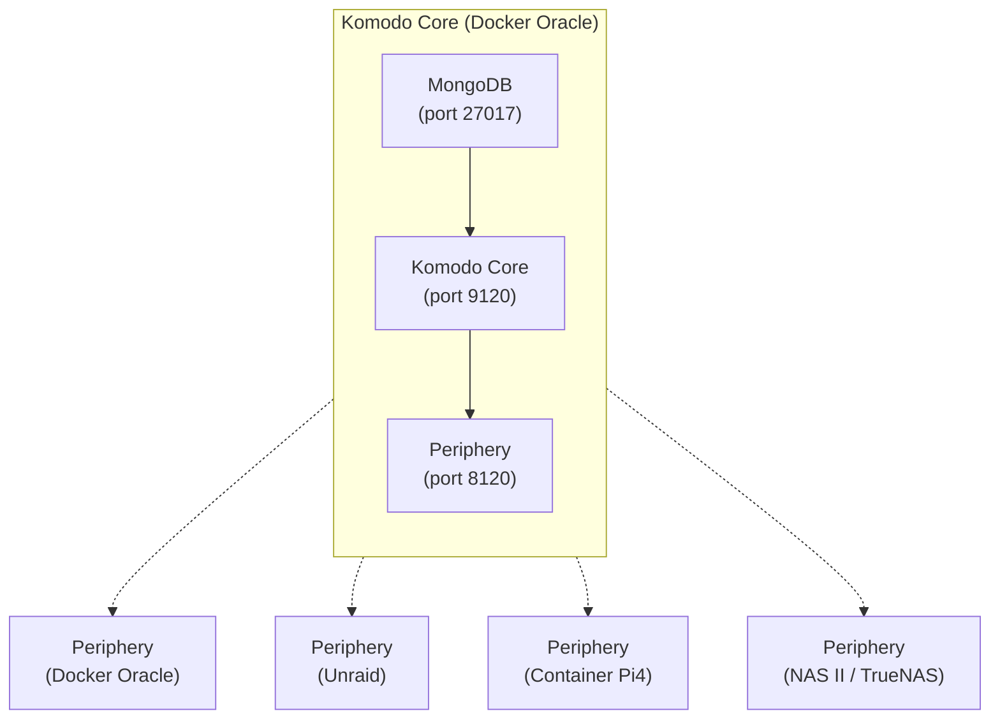

# Komodo Stacks & Resources

A comprehensive automation infrastructure for deploying and managing Docker Compose stacks across multiple servers using [Komodo](https://komo.do).

## Overview

This repository contains infrastructure-as-code for a multi-server Docker container orchestration setup. The system is powered by Komodo—a powerful automation platform that manages deployments across 4 servers (Unraid, TrueNAS SCALE, Docker Oracle, and Container Pi4) with declarative configuration, automated updates, and comprehensive monitoring.

### Key Capabilities

- **Multi-server management**: Deploy and manage containers across 4 heterogeneous servers
- **Automated deployments**: Declarative stack definitions synced from Git
- **Auto-updates**: Daily automated updates with configurable polling
- **Backup & monitoring**: Scheduled backups and system health monitoring
- **AI/ML infrastructure**: GPU-accelerated services for local LLMs and AI
- **Media management**: Document scanning, video transcoding, and photo library

## Architecture

### Komodo Infrastructure



### Server Inventory

| Server Name | Platform | Tags | Purpose |
|-------------|----------|------|---------|
| **Docker Oracle** | Docker Host | `oracle`, `sync` | Core infrastructure, Kuma monitoring |
| **Unraid** | Unraid NAS | `unraid`, `sync` | Primary workload server, media services |
| **NAS II** | TrueNAS SCALE | `nas-ii`, `sync`, `backup` | Backup server (Borg), storage |
| **Container Pi4 1** | Raspberry Pi 4 | `container-pi4-1`, `sync` | Edge services, DNS, security tools |
| **Bookview MicroOS** | Linux | `brookview`, `sync` | Primary services (Vaultwarden, Tunnel) |

### Network Architecture

- **frontend**: External-facing services (AdGuard, OpenWebUI, AdventureLog)
- **backend**: Internal service communication (databases, APIs)
- **ai**: AI/ML infrastructure (Ollama, OpenWebUI, Tika)
- **pangolin**: External reverse proxy network

## Stack Documentation

### Core Infrastructure

#### Komodo Core
Self-hosted automation platform deployment with MongoDB and Periphery. This stack bootstraps the entire automation infrastructure.

**Key Services**: MongoDB (database), Komodo Core (orchestration), Periphery (agent)

---

#### Kuma
Uptime monitoring dashboard for tracking service health across all infrastructure.

**Key Features**: Service monitoring, HTTP checks, SSL certificates

---

#### Watchtower
Automated container update manager that pulls new images and recreates containers.

**Schedule**: Daily at 07:00 (Mon for Container Pi4)
**Features**: Email notifications, automatic cleanup

---

### Network Services

#### AdGuard Home
DNS-level ad blocker and content filter with sync capabilities across multiple devices.

**Features**: DNS filtering, parental controls, sync between instances
**Ports**: 53 (DNS), 3000 (web UI)

---

#### DDNS Updater
Dynamic DNS client supporting over 70 providers for automatic domain updates.

**Features**: Multiple IP detection methods, email notifications, backup system

---

#### Endlessh
SSH tarpit that slowly responds to brute force attempts, binding attackers indefinitely.

**Features**: Rate limiting, geoIP support, Prometheus metrics
**Ports**: 2222 (SSH), 2112 (metrics)

---

#### Tunnel
Cloudflare Tunnel for secure reverse proxy and remote access.

**Features**: HTTPS tunneling, no open ports required

---

### Security & Authentication

#### Vaultwarden
Self-hosted Bitwarden-compatible password manager with admin capabilities.

**Features**: Password vault, secure sharing, email notifications
**Ports**: 80 (HTTP), 3012 (WebSockets)
**Admin**: Available at `/admin` with token

---

#### Tang
Disk encryption key server for automated LUKS volume unlocking.

**Features**: Key management, network-bound disk encryption
**Ports**: 9099 (HTTP)

---

### Media & Content

#### Immich
Self-hosted photo and video backup solution with AI-powered organization.

**Features**: Automatic backup, facial recognition, album sharing
**Requirements**: GPU recommended for machine learning
**Volumes**: Photo library, configuration, libraries

---

#### Paperless-NGX
Document management system that converts scanned documents into searchable archives.

**Services**:
- **paperless**: Main application
- **postgres**: Document database
- **redis**: Caching and queuing
- **gotenberg**: Document conversion
- **tika**: Text extraction
- **paperless-ai**: AI-powered classification
- **paperless-gpt**: Chat with documents

**Features**: OCR, automatic classification, full-text search

---

#### TDarr
Media file transcoder for automating video file optimization and format conversion.

**Architecture**: Server + GPU node (RTX 3090)
**Features**: Batch processing, hardware acceleration, rules engine
**Ports**: 8266 (server), 8265 (UI), 8264 (node)

---

#### Ollama + OpenWebUI
Local LLM hosting with web interface for interacting with AI models.

**Services**:
- **ollama**: LLM runtime (48K context, q8_0 cache)
- **open-webui**: Web interface with OAuth
- **searxng-ai**: Privacy-focused search engine
- **tika**: Document text extraction

**Authentication**: Authentik OAuth integration
**Ports**: 11434 (Ollama)

---

#### Open Notebook
AI-powered personal knowledge base with speech-to-text capabilities.

**Services**:
- **speaches**: Speech recognition and TTS
- **surrealdb**: Graph database
- **open-notebook**: Main application

**Features**: Voice notes, AI search, encrypted storage

---

### Development & Tools

#### AdventureLog
Open-source adventure logging platform with geospatial features.

**Services**:
- **adventurelog-backend**: REST API (Django)
- **adventurelog-postgis**: Spatial database
- **adventurelog-frontend**: React frontend

**Features**: Location tracking, media management, social features
**Ports**: 80 (backend), 3000 (frontend)

---

#### Quay
Self-hosted Docker registry with built-in security scanning.

**Services**:
- **quay**: Registry server
- **quay-postgresql**: Main database
- **quay-redis**: Caching
- **quay-clair**: Security scanning
- **quay-clair-postgresql**: Scanner database
- **quay-mirror**: Repository mirroring

**Features**: Container scanning, geo-replication, RBAC

---

#### Newt
Network event tracking system for monitoring Docker container events.

**Features**: Real-time container monitoring, event logging
**Integration**: PANGOLIN reverse proxy

---

#### Borgmatic
Automated backup system using BorgBackup for data protection.

**Features**: Incremental backups, encryption, automated pruning
**Schedule**: Daily at 02:15

---

### System & Backup

#### Borgserver
BorgBackup server for centralized backup storage.

**Features**: SSH-based access, deduplication
**Ports**: 8822 (SSH)

---

## Configuration

### resources.toml

Declarative configuration file defining all servers, stacks, and procedures:

```toml
[[server]]
name = "Unraid"
tags = ["sync", "unraid"]

[[stack]]
name = "vaultwarden-brookview"
tags = ["sync", "brookview"]
[stack.config]
server = "Bookview MicroOS"
linked_repo = "stacks"
run_directory = "vaultwarden"
file_paths = ["compose.yaml", "ports.compose.yaml"]
environment = """
DOMAIN=https://bitwarden.brookview.app
ADMIN_TOKEN="[[VAULTWARDEN_ADMIN_TOKEN]]"
"""
```

**Key Sections**:
- `[[server]]`: Target servers with connection info
- `[[stack]]`: Docker Compose definitions with environment
- `[[repo]]`: Git repositories for syncing
- `[[procedure]]`: Scheduled automation tasks
- `[[builder]]`: Servers capable of building images
- `[[resource_sync]]`: Sync configurations

### Stack Deployment Pattern

Stacks use a multi-file compose approach:

```
stack/
├── compose.yaml          # Main services
├── network.yaml          # Network definitions
├── ports.compose.yaml    # Port mappings (optional)
└── mounts.compose.yaml   # Volume mounts (optional)
```

Environment variables are defined in `resources.toml` and can reference secrets:

```toml
environment = """
CONTAINER_DATA = /path/to/data
SECRET_VAR = [[SECRET_NAME]]
"""
```

### Environment Variables

Common patterns used across stacks:

| Variable | Purpose |
|----------|---------|
| `CONTAINER_DATA` | Base directory for application data |
| `PUID` / `PGID` | User/group IDs for file permissions |
| `TZ` | Timezone (default: America/Chicago) |
| `COMPOSE_FILE` | Multiple compose file specification |
| `[[SECRET]]` | Secret variable references |

---

## Testing & Validation

Every push to this repo runs a validation suite via [`.github/workflows/validate.yml`](.github/workflows/validate.yml). You can also run it locally with `make validate`.

The validation script ([`scripts/validate.py`](scripts/validate.py)) performs four checks:

1. **YAML syntax** — every `.yaml`/`.yml` file in the repo must parse cleanly
2. **TOML syntax** — every `.toml` file (currently just `komodo-resources/resources.toml`) must parse cleanly
3. **Docker Compose config** — `docker compose config --quiet` is run for every directory that has a `compose.yaml`. All `*.yaml`/`*.yml` files in the directory are passed as `-f` flags (with `compose.yaml` first), so network/mount/port override fragments are validated together. Stacks that reference unset env vars produce an **error** listing the missing variables. Dummy values live in [`.env.test`](.env.test) — add any new required vars there.
4. **Cross-reference check** — compares `linked_repo` in each stack's `[config]` against the current branch name:
   - On `main` → expects `linked_repo = "stacks"`
   - On any other branch → expects `linked_repo` to match the branch name
   - Only stacks whose `linked_repo` changed since `origin/main` are checked

### Updating the tests

If you are an AI assistant modifying this validation suite, follow these rules:

- **Adding a new check**: Add a new function like `validate_*()` in `scripts/validate.py`, call it from `main()`, append errors/warnings to the global `errors`/`warnings` lists as appropriate, and let the existing summary logic handle exit codes.
- **Adding a new compose file type**: Every directory with a `compose.yaml` is auto-detected. All `*.yaml`/`*.yml` files in that directory are treated as compose fragments and passed to `docker compose -f`. If a stack uses a different main filename, update `compose_files()` in the script.
- **Adding env vars for compose validation**: Add a dummy value to `.env.test`. Missing vars now cause an **error** (not a warning) with the variable names listed. Do **not** add real secrets — this file is checked into the repo.
- **Changing ignore rules**: `IGNORE_DIRS` controls which top-level directories are skipped (e.g. `.git`, `.opencode`). Use exact directory names, not `startswith` — `.github` and `.git` are different dirs.
- **Running locally**: `make validate` or `./scripts/validate.py`. Requires Python 3.11+, `pyyaml`, and `docker compose`.
- **Dependabot**: `.github/dependabot.yml` keeps GitHub Actions up to date weekly. To add other ecosystems (e.g. Docker, pip), add a new `package-ecosystem` entry there.

---

## Quick Reference

### Server Tags

| Tag | Description |
|-----|-------------|
| `unraid` | Deployments targeting Unraid NAS |
| `oracle` | Deployments targeting Docker Oracle |
| `brookview` | Deployments targeting Bookview MicroOS |
| `container-pi4-1` | Deployments targeting Raspberry Pi |
| `nas-ii` | Deployments targeting TrueNAS SCALE |
| `sync` | Resources synced to Komodo |
| `backup` | Backup-related services |

### Scheduled Procedures

| Procedure | Schedule | Purpose |
|-----------|----------|---------|
| Backup Core Database | 01:00 daily | MongoDB backup |
| Global Auto Update | 01:15 daily | Pull/update stacks with `auto_update` or `poll_for_updates` |

---

## Getting Started

1. Deploy Komodo Core on a management server (see [komodo-core](./komodo-core))
2. Deploy Periphery agents on target servers (see [komodo-periphery](./komodo-periphery))
3. Configure `resources.toml` with your server connections and stack definitions
4. Sync resources from this repository
5. Deploy stacks via Komodo UI or API

See [Komodo Documentation](https://komo.do) for detailed setup guides.

---

## Repository Structure

```
stacks/
├── .github/workflows/    # CI/CD workflows
│   └── validate.yml      #   Push/PR validation
├── komodo-core/           # Komodo Core infrastructure
│   ├── compose.yaml
│   └── network.yaml
├── komodo-periphery/      # Periphery agent
│   ├── compose.yaml
│   └── mounts.compose.yaml
├── komodo-resources/      # Declarative configuration
│   └── resources.toml
├── scripts/               # Tooling
│   └── validate.py        #   Validation script
├── Makefile                # Local dev commands
├── .env.test               # Dummy env vars for compose validation
├── adguard/               # DNS filtering
├── adventurelog/          # Adventure logging platform
├── borgserver/            # Backup server
├── borgmatic/             # Backup client
├── ddns-updater/          # Dynamic DNS
├── endlessh-go/           # SSH tarpit
├── immich/                # Photo backup
├── kuma/                  # Uptime monitoring
├── ollama/                # LLM hosting
├── open-notebook/         # Knowledge base
├── paperless/             # Document management
├── quay/                  # Docker registry
├── tdarr/                 # Video transcoder
├── tunnel/                # Cloudflare Tunnel
├── vaultwarden/           # Password manager
├── watchtower/            # Auto-updater
└── newt/                  # Event tracker
```

---

## Related Repositories

- [stacks](https://github.com/FlexibleToast/stacks) - This repository
- [forgejo-resources](https://git.mcdade.app/FlexibleToast/komodo) - Internal secrets repository

---

## License

This repository contains infrastructure configurations for personal use.
